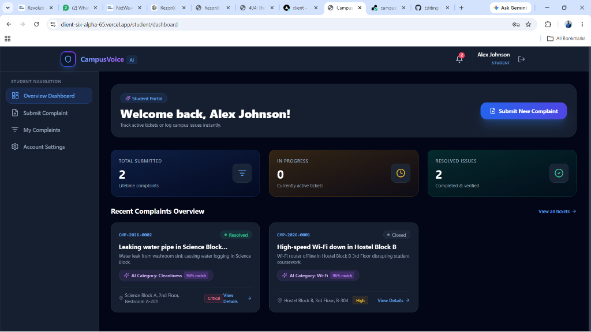
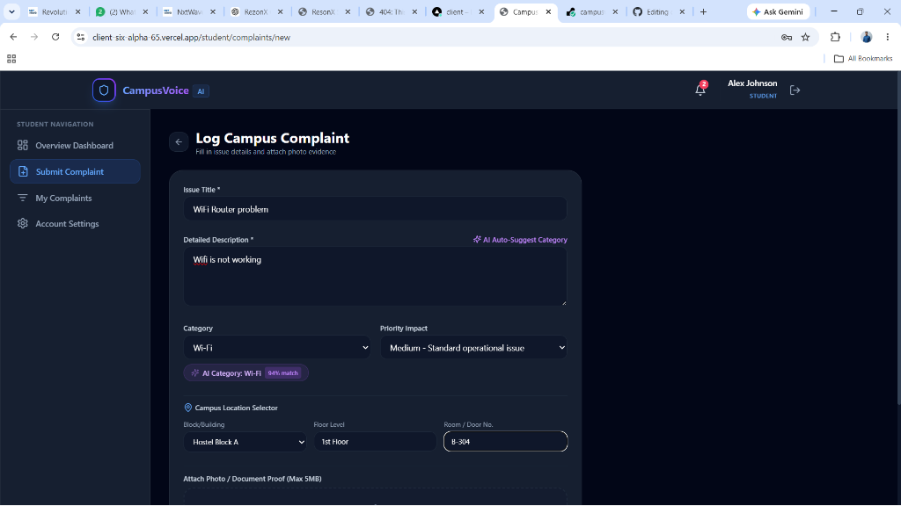
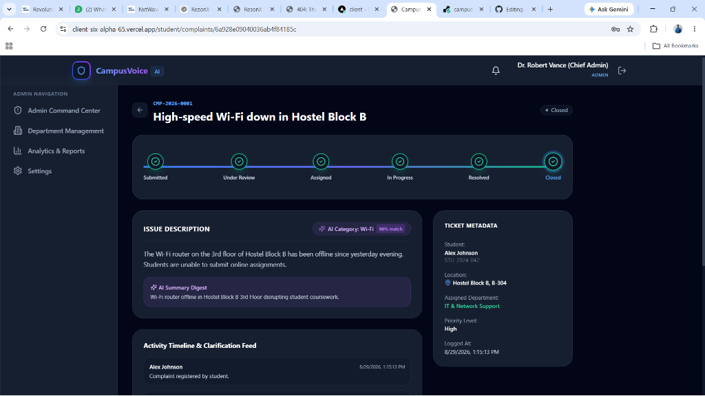
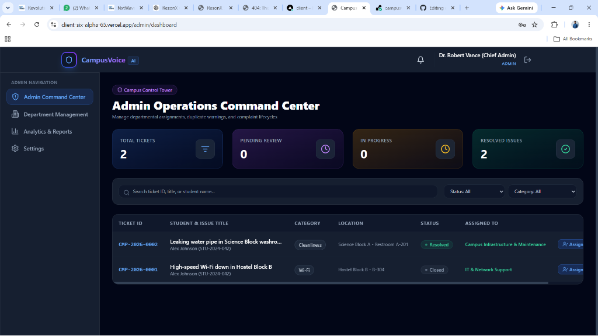
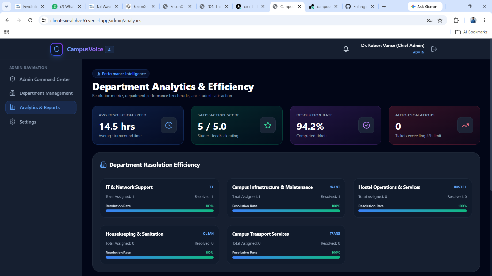

# 1. Project Name
**CampusVoice AI (EduResolve) — College Complaint & Operations Management System**

---

# 2. Problem Statement
Educational institutions often struggle with managing student grievances regarding classrooms, laboratories, hostel facilities, Wi-Fi connectivity, cleanliness, infrastructure, and transportation. Traditional reporting mechanisms suffer from manual paperwork, delayed department allocation, zero real-time status visibility for students, and lack of accountability for unresolved tickets.

**CampusVoice AI** solves these issues by providing a digitized, AI-assisted operations management tower. Students log issues in seconds with precise campus locations and photo attachments, while Google Gemini AI auto-categorizes complaints, generates executive digests, and flags duplicate submissions. College administrators gain a real-time command center to assign, monitor, escalate, and analyze campus resolutions efficiently.

---

# 3. Features

### Core Features
- **Multi-Role Authentication & RBAC**: Dedicated user portals for `Student`, `Administrator`, and `Department Staff` with protected route middleware and bcrypt-hashed security.
- **6-Stage Standardized Complaint Lifecycle**: Visual progress pipeline tracking tickets through `Submitted` ➔ `Under Review` ➔ `Assigned` ➔ `In Progress` ➔ `Resolved` ➔ `Closed`.
- **Campus Location Selector**: Granular location picker (Building Block, Floor, Room Number, Custom Details).
- **Multi-File Attachment Proof**: Multer upload handling for photo proof (JPEG, PNG, WEBP, PDF up to 5MB).
- **Student Resolution Feedback & Rating**: Students verify resolution quality and submit 1 to 5 star ratings and reviews before closing tickets.
- **Admin Command Center & Department Management**: Department creation, lead assignment, and interactive ticket queue.
- **Department Efficiency Analytics**: Metrics on resolution speed (hours), student satisfaction score, and category breakdown.

### AI & Intelligent Automation Features (Bonus)
- **AI Auto-Categorization**: Google Gemini AI analyzes title and description text to auto-assign categories with confidence scores.
- **AI Executive Summarization**: Generates 1-2 sentence executive summaries for administrator tables.
- **AI Duplicate Complaint Detector**: Embeds and compares recent submissions in the same building block to alert admins of duplicate reports.
- **Real-Time Socket.IO Synchronisation**: Live status timeline updates and real-time notification alerts without page refreshes.
- **Background Auto-Escalation Engine**: Node-Cron scheduler checking unresolved tickets (>48h) and auto-escalating priority to `Critical` with admin alerts.
- **1-Click Quick Fill Demo Logins**: Instant credential autofill on login screen for Student, Admin, and IT Staff roles.

---

# 4. Technology Stack

- **Frontend**: Next.js 14 (Pages Router), React 18, Tailwind CSS, Zustand (State Management), Axios, Socket.IO Client, Lucide React Icons, Chart.js.
- **Backend**: Node.js, Express.js, MongoDB with Mongoose ODM (includes `mongodb-memory-server` zero-config fallback), JSON Web Tokens (JWT), bcryptjs, Multer, Socket.IO, Nodemailer, Node-Cron.
- **AI Engine**: Google Generative AI SDK (`@google/generative-ai` / Gemini API) with intelligent heuristic fallback rules.

---

# 5. Screenshots

### 1. Student Overview Dashboard

> Displays complaint progress overview, active status metrics, and quick submission CTA.

### 2. Complaint Submission Form with AI Auto-Suggest Category

> Interactive form featuring AI category auto-suggestion, campus location selector, and photo proof uploader.

### 3. Interactive Complaint Detail Page & Visual Progress Pipeline

> Visual step-by-step resolution step tracker, official resolution proof banner, live clarification feed, and student 5-star rating.

### 4. Admin Operations Command Center

> Centralized ticket queue table, status filters, department assignment modal, and duplicate detection alerts.

### 5. Department Analytics & Performance Intelligence

> Department resolution rate benchmarks, average turnaround speed (hours), and category breakdown metrics.

---

# 6. Live Demo
- **Deployed Application (Vercel)**: [https://client-six-alpha-65.vercel.app](https://client-six-alpha-65.vercel.app)

---

# 7. Backend
- **Deployed Backend API (Render)**: [https://campusvoice-backend.onrender.com](https://campusvoice-backend.onrender.com)
- **API Health Check**: [https://campusvoice-backend.onrender.com/api/health](https://campusvoice-backend.onrender.com/api/health)

---

# 8. Setup Instructions

Follow these steps to run the application locally on your computer.

### Step 1: Clone or Open the Repository
```bash
git clone https://github.com/ManojR-cs/campusvoice-ai.git
cd campusvoice-ai
```

### Step 2: Install Dependencies
Install dependencies for both backend and frontend:
```bash
# Install root & workspace packages
npm run install:all
```
*(Or navigate into `server/` and `client/` individually and run `npm install`)*

### Step 3: Seed Database with Demo Accounts & Complaints
Run the automated seeder script to populate sample users, departments, and complaints:
```bash
cd server
npm run seed
```

Output confirmation:
```text
[Seeder] Database seeding completed successfully!
Test Demo Accounts:
1. Admin: admin@college.edu / AdminPass123!
2. Student: student@college.edu / StudentPass123!
3. Staff (IT): staff.it@college.edu / StaffPass123!
4. Staff (Maint): staff.maint@college.edu / StaffPass123!
```

### Step 4: Run Development Servers

Terminal 1 (Backend API Server):
```bash
cd server
npm run dev
```
*(Runs on `http://localhost:5000`)*

Terminal 2 (Frontend Web App):
```bash
cd client
npm run dev
```
*(Runs on `http://localhost:3000`)*

Open your browser at **`http://localhost:3000`**.

---

# 9. Environment Variables

The application relies on the following environment variables. Set these in your `.env` file inside the `server/` directory:

| Environment Variable | Description | Example / Required |
| :--- | :--- | :--- |
| `PORT` | Backend server port | `5000` |
| `MONGO_URI` | MongoDB connection string | `mongodb://127.0.0.1:27017/campusvoice` |
| `JWT_SECRET` | Secret key for signing JWT session tokens | `your_jwt_secret_key` |
| `JWT_EXPIRES_IN` | Token expiration duration | `7d` |
| `CLIENT_URL` | Frontend URL for CORS configuration | `http://localhost:3000` |
| `GEMINI_API_KEY` | Google Generative AI API Key *(Optional - Heuristics fallback available)* | `your_google_gemini_api_key` |
| `EMAIL_HOST` | SMTP server host for Nodemailer alerts | `smtp.ethereal.email` |
| `EMAIL_PORT` | SMTP server port | `587` |
| `EMAIL_USER` | SMTP username | `your_smtp_user` |
| `EMAIL_PASS` | SMTP password | `your_smtp_password` |

